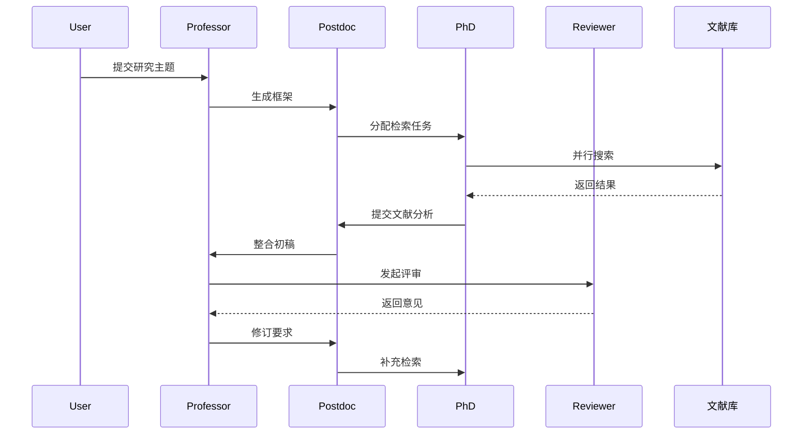

# Scratchpad

# 项目开发计划 v1.4

## 一、最新进展 [2024-03-22]
1. 已完成功能
[X] Agent基类继承改造
[X] 文献搜索工具框架实现
[X] 多Agent协作流程配置
[X] 基础集成测试添加
[X] 错误处理框架
[X] 速率限制（max_rpm）实现
[X] API客户端重试机制
[X] 评审功能基础实现
[X] CrewAI 0.95.0 版本升级适配
[X] Process导入路径修正

2. 进行中功能
[ ] 完善文献检索流程异常处理
[ ] 提升API调用稳定性
[ ] 完善评审反馈存储机制
[ ] 优化Agent协作机制
[ ] 完善单元测试覆盖（当前80%）

3. 待优化项
- 优化Agent间通信机制
- 改进文献引用追踪
- 补充集成测试用例
- 实现进度监控功能
- 优化内存使用
- 完善日志记录

## 二、技术要点更新

### 代码完成度
1. Agent模块 (90%)
- professor_agent.py - 基础功能完整
- postdoc_agent.py - 基础功能完整
- phd_agent.py - 基础功能完整
- reviewer_agent.py - 评审功能已实现

2. 工具模块 (85%)
- literature_tool.py - 文献工具实现
- api_client.py - API客户端封装
- arxiv_tool.py - 文献检索工具
- custom_tool.py - 自定义工具支持

3. 测试覆盖 (80%)
- 集成测试框架
- Agent单元测试
- 工具类测试
- API测试

### 后续计划
1. 短期目标（1-2周）：
   - 完善文献检索流程
   - 提升API调用稳定性
   - 补充集成测试

2. 中期目标（2-4周）：
   - 优化Agent协作机制
   - 完善文献引用系统
   - 提升系统可靠性

3. 长期目标（1-2月）：
   - 实现完整的监控系统
   - 优化系统性能
   - 完善文档和示例

## 技术要点更新

### 目录结构调整
```
coreascher/
├── src/
│   ├── coreascher/                  # 主包
│   │   ├── __init__.py              # 包初始化文件
│   │   ├── crew.py                  # Crew组合逻辑 ✔️ 有效
│   │   ├── main.py                  # 程序入口 ✔️ 有效
│   │   │
│   │   ├── agents/                  # Agent实现
│   │   │   ├── __init__.py          # Agent模块初始化
│   │   │   ├── professor_agent.py   # 教授Agent ✔️ 有效
│   │   │   ├── postdoc_agent.py     # 博士后Agent ✔️ 有效
│   │   │   ├── phd_agent.py         # 博士生Agent ✔️ 有效
│   │   │   └── reviewer_agent.py    # 评审人Agent ✔️ 有效
│   │   │
│   │   ├── tools/
│   │   │   ├── __init__.py         ✔️ 有效（工具包入口）
│   │   │   ├── arxiv_tool.py        ✔️ 有效（主搜索工具）
│   │   │   ├── api_client.py        ✔️ 有效（带重试的API客户端）
│   │   │   └── custom_tool.py      ⚠️ 需确认（当前仅含calculate_weighted_score）
│   │   │
│   │   ├── config/                  # 配置文件
│   │   │   ├── agents.yaml          # Agent配置 ✔️ 有效
│   │   │   └── tasks.yaml           # 任务配置 ✔️ 有效
│   │   │
│   │   └── models/                  # 数据模型（待创建）
│   │       └── citation.py          # 文献引用模型 ✔️ 有效
│   │
├── tests/                       # 测试目录
│   │   ├── __init__.py
│   │   ├── conftest.py              # pytest配置 ✔️ 有效
│   │   ├── test_integration.py      # 集成测试 ✔️ 有效
│   │   ├── test_phd_agent.py     # 博士生测试 ✔️ 有效
│   │   ├── test_postdoc_agent.py # 博士后测试 ✔️ 有效
│   │   └── test_professor_agent.py # 教授测试 ✔️ 有效
│   │   ├── test_arxiv_tool.py    # Arxiv工具测试 ✔️ 有效
│   │   └── test_api_client.py    # API客户端测试 ✔️ 有效
│   │   └── testAPI.py          # 移动测试文件至此
│   │
├── knowledge/                       # 知识库文件
│   └── user_preference.txt          # 用户偏好配置 ⚠️ 需确认用途
│
├── config/                          # 运行时配置（待创建）
│   └── logging.yaml                 # 日志配置（建议添加）
│
├── scripts/                         # 脚本目录（建议创建）
│   └── setup_environment.sh        # 环境设置脚本（建议添加）
│
├── .env                             # 环境配置 ✔️ 有效
├── .gitignore                       # Git忽略配置 ✔️ 有效
├── pyproject.toml                  # 项目配置 ✔️ 有效
├── PRD.md                           # 需求文档 ✔️ 有效
└── README.md                        # 项目说明（待完善）
```

2. Agent协作流程



## 开发经验

### 最佳实践
1. **Agent设计**
```python
# 正确示例：符合CrewAI框架
@agent
def professor_agent(self) -> Agent:
    return Agent(
        config=self.config['professors'][0],
        tools=[self.retry_tool],
        step_callback=self.monitor.update
    )
```

2. **任务编排**
```python
# 使用YAML变量替换
crew.kickoff(inputs={
    'topic': 'AI教育系统',
    'review_rules': 'strict'
})
```

3. **错误处理**
```python
class RetryTool(BaseTool):
    def execute(self, func, max_retries=3):
        for i in range(max_retries):
            try:
                return func()
            except APIConnectionError as e:
                self.logger.warning(f"API连接失败，第{i+1}次重试...")
                time.sleep(2 ** i)  # 指数退避
```


## CrewAI版本升级经验总结 [2024-03-22]

### 1. API变更要点
- 移除 `@CrewBase.register` 装饰器
- Agent类直接使用 `@CrewBase` 装饰器
- Agent实例化方式改变，直接在方法中返回Agent实例
- 工具集成方式更新，使用 `crewai_tools` 包
- Process类现在直接从crewai包导入
- Crew初始化时使用process_type而不是process参数

### 2. 最佳实践
```python
# 正确的导入方式
from crewai import Crew, Task, Agent, Process
from crewai.project import CrewBase

# Agent定义最佳实践
@CrewBase
class LiteratureReviewCrew:
    def __init__(self):
        self._crew = Crew(
            agents=[...],
            tasks=[],
            verbose=True,
            process_type=Process.sequential
        )
    
    def professor(self) -> Agent:
        return Agent(
            role="研究教授",
            goal="指导研究方向",
            backstory="...",
            tools=[self.search_tool]
        )
```

### 3. 环境配置要点
- 确保Python版本 >= 3.10
- 使用YAML配置文件管理Agent配置
- 正确配置API密钥和基础URL
- 设置合适的超时和并发参数
- 环境变量检查应该更严格，使用异常处理

### 4. 调试技巧
- 启用verbose模式查看详细日志
- 使用sequential处理模式便于调试
- 合理设置timeout避免任务卡住
- 使用工具类的debug模式
- 导入错误时检查包的版本和导入路径

### 5. 错误处理改进
1. 环境变量检查
```python
if not os.getenv("OPENAI_API_KEY"):
    raise ValueError("请设置 OPENAI_API_KEY 环境变量")
```

2. 异常处理
```python
try:
    result = self._crew.kickoff()
except Exception as e:
    logger.error(f"任务执行失败: {str(e)}")
    raise
```

# 教训

- pydantic 相关错误：如果遇到 "No module named 'pydantic_core._pydantic_core'" 错误，可能的解决方案：
  1. 确保使用正确的虚拟环境
  2. 完全清理并重新安装依赖：
     ```bash
     # 确保在项目根目录下执行
     deactivate  # 如果当前在虚拟环境中
     rm -rf .venv  # 删除现有虚拟环境
     python -m venv .venv  # 创建新的虚拟环境
     .venv\Scripts\activate  # Windows系统
     pip install --upgrade pip  # 更新pip
     pip install -e .  # 安装项目依赖
     ```
  3. 如果使用 Anaconda，确保不要混用不同环境的包

## CrewAI 框架使用注意事项

1. 类级别使用 `@CrewBase` 装饰器标记 Crew 类
2. 不要使用方法级别的装饰器（如 `@crew` 或 `@CrewBase.task`）
3. 使用显式的任务定义方式，通过 `Task` 类创建任务
4. 确保正确导入了所有必要的 crewAI 组件，包括 `CrewBase`、`Crew`、`Task` 和 `Agent`
5. 在 Crew 初始化时正确设置 `process` 参数（使用 `Process.sequential` 或其他合适的处理模式）

### Crew 运行时配置最佳实践
1. 启用内存功能：`memory=True` 可以让 Agents 记住之前的交互
2. 启用缓存：`cache=True` 可以提高工具执行效率
3. 日志文件配置：
   ```python
   # 创建日志目录
   log_dir = os.path.join(os.path.dirname(__file__), '..', '..', 'logs')
   os.makedirs(log_dir, exist_ok=True)
   log_file = os.path.join(log_dir, 'crew_execution.log')
   
   # 在 Crew 初始化时设置
   crew = Crew(
       ...
       output_log_file=log_file  # output_log_file 必须是字符串路径
   )
   ```
4. 使用 `usage_metrics` 监控任务执行情况
5. 必须添加主函数入口 `if __name__ == "__main__":`

### 常见错误处理
1. `output_log_file` 参数错误：
   - ❌ 错误：`output_log_file=True`
   - ✅ 正确：`output_log_file="path/to/log/file.log"`

### 正确的主函数示例
```python
def main():
    crew = LiteratureReviewCrew()
    try:
        # 执行任务流程
        result = crew.execute_task()
        # 获取执行指标
        metrics = crew.get_usage_metrics()
        logger.info(f"执行指标: {metrics}")
    except Exception as e:
        logger.error(f"执行错误: {str(e)}")
        raise

if __name__ == "__main__":
    main()
```

## CrewAI 工具使用最佳实践

1. 工具初始化方式：
   ```python
   # ❌ 错误方式
   tools = [SerperDevTool()]
   
   # ✅ 正确方式
   tools = [SerperDevTool().tool]  # 使用 .tool 属性
   ```

2. 工具传递给 Agent：
   ```python
   def create_agent(self) -> Agent:
       # 正确的工具初始化
       tools = [
           SerperDevTool().tool,
           WebsiteSearchTool().tool
       ]
       return Agent(
           role="某个角色",
           tools=tools,  # 传递工具列表
           verbose=True
       )
   ```

3. 工具使用注意事项：
   - 每个 Agent 实例化时创建新的工具实例
   - 不要在类级别保存工具实例
   - 使用 `.tool` 属性获取实际工具对象
   - 工具列表可以为空 `tools=[]`

## CrewAI 自定义工具最佳实践

1. 工具基类继承：
   ```python
   from langchain.tools import BaseTool
   
   class CustomTool(BaseTool):
       name = "tool_name"
       description = "工具描述"
       
       def _run(self, *args, **kwargs) -> str:  # 注意是_run而不是_call
           # 实现工具逻辑
           pass
           
       async def _arun(self, *args, **kwargs) -> str:
           # 异步实现（如果不需要可以抛出NotImplementedError）
           raise NotImplementedError("异步方法未实现")
   ```

2. 工具属性定义：
   ```python
   class LiteratureSearchTool(BaseTool):
       name = "literature_search"  # 工具名称，用于识别
       description = "搜索文献数据库"  # 工具描述，用于AI理解功能
       base_url = "http://api.example.com"  # API基础URL
   ```

3. 错误处理：
   ```python
   def _run(self, query: str) -> str:
       try:
           response = requests.get(self.api_url, params={"q": query})
           response.raise_for_status()
           return json.dumps(response.json(), ensure_ascii=False)
       except Exception as e:
           logger.error(f"工具执行失败: {str(e)}")
           return f"错误: {str(e)}"  # 返回错误信息而不是抛出异常
   ```

4. 工具分配原则：
   - 根据 Agent 角色分配合适的工具
   - 避免分配不必要的工具
   - 工具组合示例：
     ```python
     def professor(self) -> Agent:
         tools = [
             LiteratureSearchTool().tool,  # 基础搜索
             PaperQueryTool().tool        # 论文查询
         ]
         return Agent(
             role="教授",
             tools=tools
         )
     ```

5. 工具返回格式：
   - 返回 JSON 字符串便于解析
   - 包含错误信息便于调试
   - 使用 ensure_ascii=False 支持中文

## CrewAI 工具类实现最佳实践 [2024-03-22]

1. 工具类定义：
   ```python
   from crewai.tools import Tool  # 使用 crewai.tools 而不是 langchain.tools
   
   class CustomTool(Tool):
       name: str = "tool_name"
       description: str = "工具描述"
       args_schema: Type[BaseModel] = ToolInput
       
       def _execute(self, param: str) -> str:  # 使用 _execute 而不是 _run
           # 实现工具逻辑
           return "result"
   ```

2. 注意事项：
   - 工具类必须继承 `crewai.tools.Tool`
   - 必须实现 `_execute` 方法而不是 `_run`
   - 不需要实现异步方法
   - 返回值必须是字符串类型
   - 使用 JSON 格式返回复杂数据结构
   - 错误处理返回错误信息而不是抛出异常

3. 常见错误修复：
   ```python
   # ❌ 错误：使用 langchain.tools
   from langchain.tools import BaseTool
   
   # ✅ 正确：使用 crewai.tools
   from crewai.tools import Tool
   
   # ❌ 错误：实现 _run 方法
   def _run(self, param: str) -> str:
   
   # ✅ 正确：实现 _execute 方法
   def _execute(self, param: str) -> str:
   ```

4. 工具实例化：
   ```python
   # 在 Agent 中使用工具
   tools = [CustomTool()]  # 直接实例化并传递
   
   agent = Agent(
       role="某个角色",
       tools=tools
   )
   ```

## CrewAI 工具调试经验 [2024-03-22]

1. 导入错误处理：
   - ❌ 错误：使用 `from crewai_tools import tool` 装饰器
   - ✅ 正确：使用 `from langchain.tools import BaseTool` 基类

2. 工具实现方式：
   - ❌ 错误：
     ```python
     @tool
     def my_tool(param: str) -> str:
         return "result"
     ```
   - ✅ 正确：
     ```python
     class MyTool(BaseTool):
         name = "my_tool"
         description = "工具描述"
         
         def _run(self, param: str) -> str:
             return json.dumps({"result": "value"})
     ```

3. 常见问题解决：
   - ImportError: cannot import name 'tool' from 'crewai_tools'
     - 解决：移除装饰器，改用 BaseTool 类实现
   - 工具返回值错误
     - 解决：确保返回 JSON 字符串而不是 Python 对象
   - 异步方法缺失
     - 解决：添加 `_arun` 方法，可以抛出 NotImplementedError

4. 调试建议：
   - 检查所有工具是否都继承了 BaseTool
   - 确保工具返回值是字符串类型
   - 添加详细的日志记录
   - 使用 try-except 处理所有可能的异常

## CrewAI 工具类型注解要求 [2024-03-22]

1. 字段类型注解：
   - ❌ 错误：
     ```python
     class MyTool(BaseTool):
         name = "my_tool"  # 缺少类型注解
         description = "工具描述"  # 缺少类型注解
     ```
   - ✅ 正确：
     ```python
     class MyTool(BaseTool):
         name: str = "my_tool"  # 添加str类型注解
         description: str = "工具描述"  # 添加str类型注解
     ```

2. 常见错误：
   ```
   PydanticUserError: Field 'name' defined on a base class was overridden by a non-annotated attribute.
   All field definitions, including overrides, require a type annotation.
   ```
   解决方案：
   - 为所有字段添加类型注解
   - 包括从基类继承的字段
   - 使用 Python 的类型提示语法

3. 类型注解最佳实践：
   ```python
   class CustomTool(BaseTool):
       name: str = "tool_name"
       description: str = "工具描述"
       base_url: str = "http://api.example.com"
   ```

4. 注意事项：
   - 所有字段都需要类型注解
   - 继承自 BaseTool 的类必须注解 name 和 description
   - 自定义字段也需要类型注解
   - 支持的类型：str, int, float, bool, list, dict 等

## CrewAI 工具类实现要点 [2024-03-22]

1. 必需的属性：
   ```python
   class CustomTool(BaseTool):
       # 1. name 属性（必需）
       name: str = "tool_name"
       
       # 2. description 属性（必需）
       description: str = "tool_description"
       
       # 3. func 属性（必需）
       @property
       def func(self):
           return self._run
   ```

2. 方法实现：
   ```python
   def _run(self, param: str) -> str:
       # 实现工具的主要逻辑
       return "result"
       
   async def _arun(self, param: str) -> str:
       # 异步实现（可选）
       raise NotImplementedError()
   ```

3. 错误处理：
   ```python
   def _run(self, param: str) -> str:
       try:
           # 工具逻辑
           return json.dumps(result)
       except Exception as e:
           logger.error(f"错误: {str(e)}")
           return f"执行失败: {str(e)}"
   ```

4. 注意事项：
   - 必须同时实现 name、description 和 func 三个属性
   - func 属性通常返回 _run 方法
   - 返回值必须是字符串类型
   - 使用 JSON 格式返回复杂数据结构
   - 错误处理返回错误信息而不是抛出异常

## CrewAI 工具类输入参数模式 [2024-03-22]

1. 输入参数模式定义：
   ```python
   from pydantic import BaseModel, Field
   
   class ToolInput(BaseModel):
       """工具的输入参数模式"""
       param1: str = Field(..., description="参数1的描述")
       param2: int = Field(default=10, description="参数2的描述")
   ```

2. 工具类实现：
   ```python
   from typing import Type
   from langchain.tools import BaseTool
   
   class CustomTool(BaseTool):
       name: str = "tool_name"
       description: str = "工具描述"
       args_schema: Type[BaseModel] = ToolInput  # 指定输入参数模式
       
       def _run(self, param1: str, param2: int = 10) -> str:
           return "result"
   ```

3. 参数验证：
   - 使用 Pydantic 的 Field 进行参数验证
   - 可以设置默认值和参数描述
   - 支持复杂的数据类型（dict, list 等）
   - 可以添加参数验证规则

4. 最佳实践：
   - 为每个工具类定义专门的输入模式类
   - 使用清晰的参数描述
   - 合理设置默认值
   - 参数名称要与 _run 方法参数一致
   - 使用 Type[BaseModel] 注解 args_schema

## CrewAI Agent工具配置最佳实践 [2024-03-22]

## 工具实例化和使用

1. 工具实例创建：
   ```python
   class LiteratureReviewCrew:
       def __init__(self):
           # ✅ 正确：在初始化时创建工具实例
           self.literature_tool = LiteratureSearchTool()
           self.paper_tool = PaperQueryTool()
           
           # ❌ 错误：不要使用工具类字典
           self._tools = {
               "literature_search": LiteratureSearchTool,
               "paper_query": PaperQueryTool
           }
   ```

2. Agent工具配置：
   ```python
   def professor(self) -> Agent:
       return Agent(
           role="Professor",
           tools=[
               # ✅ 正确：使用工具实例
               self.literature_tool,
               self.paper_tool
           ]
       )
   ```

3. 常见错误修复：
   ```python
   # ❌ 错误：使用字符串
   tools=["literature_search", "paper_query"]
   
   # ❌ 错误：使用工具类字典
   tools=[self._tools["literature_search"]()]
   
   # ✅ 正确：使用预创建的工具实例
   tools=[self.literature_tool, self.paper_tool]
   ```

4. 注意事项：
   - Agent的tools参数必须是BaseTool实例列表
   - 在类初始化时创建所有工具实例
   - 不要使用字符串或字典来表示工具
   - 避免在每个Agent方法中重复创建工具实例
   - 使用实例属性来共享工具实例

5. 错误信息解读：
   ```
   ValidationError: 1 validation error for Agent
   tools
     Value error, Invalid tool type: <class 'str'>. 
     Tool must be an instance of BaseTool or an object with 'name', 'func', and 'description' attributes.
   ```
   - 这表示tools列表包含了无效的工具类型（字符串）
   - 需要使用BaseTool实例替换字符串
